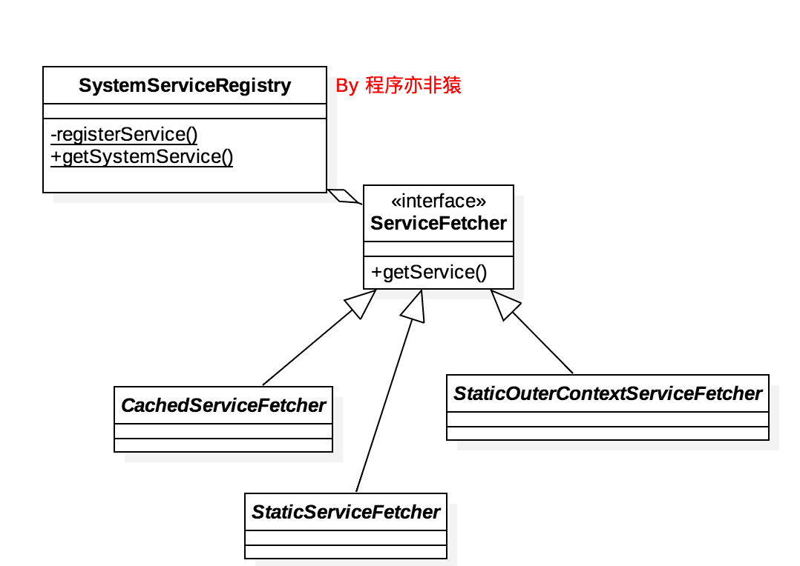

# Context.getSystemService分析


## 引言

Context.getSystemService(String) 方法是我们用来获取各种系统服务的手段，比如：

```
LayoutInflater LayoutInflater = (LayoutInflater) context.getSystemService(Context.LAYOUT_INFLATER_SERVICE);

ActivityManager am = (ActivityManager) cxt.getSystemService(Context.ACTIVITY_SERVICE);
```

BONUS：像这样传入不同的参数(或 String 或 int)，返回不同的对象，通常称为『工厂方法』。


那么问题来了：**这些服务是从哪里来的呢？**

在[Android应用的程序入口是哪里？](where-is-app's-entrance.md)一文中我们知道了，我们App的 Context 的实例实际是 ContextImpl的实例，所以需要去它那边研究。 

接下去分析。

## 深入分析

看看 ContextImpl 的 getSystemService：

```
@Override
public Object getSystemService(String name) {
    return SystemServiceRegistry.getSystemService(this, name);
}
```

发现调用了 SystemServiceRegistry.getSystemService：

```
// SystemServiceRegistry
public static Object getSystemService(ContextImpl ctx, String name) {
    ServiceFetcher<?> fetcher = SYSTEM_SERVICE_FETCHERS.get(name);
    return fetcher != null ? fetcher.getService(ctx) : null;
}
```

SystemServiceRegistry 是什么？ServiceFetcher又是什么？ 

当切换到一个新的不熟悉的类的时候，先不要着急，先看看这个类的介绍、结构与方法等，先大致了解一下，再继续深入研究。

### SystemServiceRegistry

来看看 SystemServiceRegistry 的定义以及我画的类图:

```
/**
 * Manages all of the system services that can be returned by {@link Context#getSystemService}.
 * Used by {@link ContextImpl}.
 */
final class SystemServiceRegistry{}
```



可以清楚的看到，SystemServiceRegistry 是『用来管理所有 ContextImpl.getSystemService 所返回的系统服务』的； ServiceFetcher 则是一个泛型接口。

那么是如何管理的呢？

#### 系统服务的注册

在 SystemServiceRegistry 中有一个`static`块，代码是这样的：

```
static{
    registerService(Context.LAYOUT_INFLATER_SERVICE, LayoutInflater.class,
        new CachedServiceFetcher<LayoutInflater>() {
    @Override
    public LayoutInflater createService(ContextImpl ctx) {
        return new PhoneLayoutInflater(ctx.getOuterContext());
    }});

    registerService(Context.ALARM_SERVICE, AlarmManager.class,
            new CachedServiceFetcher<AlarmManager>() {
    @Override
    public AlarmManager createService(ContextImpl ctx) {
        IBinder b = ServiceManager.getService(Context.ALARM_SERVICE);
        IAlarmManager service = IAlarmManager.Stub.asInterface(b);
        return new AlarmManager(service, ctx);
    }});
    //...
}
```

我挑了两个例子展示，省略了其他的系统服务注册代码，因为实际上，生成系统服务，就这两种方式：

1. 一种是 直接实例化对象，如`PhoneLayoutInflater`是直接`new`出来的。  
2. 另外一种是从`ServiceManager.getService(String)`获取的。

PS：ServiceManager 涉及到了 ServiceManagerNative、Binder、Binder 驱动等相关知识，非常复杂，这里不展开去研究，以后会有机会讲。

**原来是在 static 代码块里注册了所有的系统服务**。

#### 系统服务的缓存实现

像这种系统服务一般都是大对象，单例，不可能每次获取都是去新建。

所以当然会有缓存啦。

这个缓存在 ContextImpl 中

```
final Object[] mServiceCache = SystemServiceRegistry.createServiceCache();
```

至于存入缓存的时机，需要看一个 ServiceFetcher 的实现（其他几个原理类似）

```
// SystemServiceRegistry
static abstract class CachedServiceFetcher<T> implements ServiceFetcher<T> {
    private final int mCacheIndex;

    public CachedServiceFetcher() {
        mCacheIndex = sServiceCacheSize++;
    }

    @Override
    @SuppressWarnings("unchecked")
    public final T getService(ContextImpl ctx) {
    	// 获取缓存
        final Object[] cache = ctx.mServiceCache;
        synchronized (cache) {
            // Fetch or create the service.
            Object service = cache[mCacheIndex];
            // 如果缓存里没有 则调用 createService 去生成。
            if (service == null) {
                service = createService(ctx);
                cache[mCacheIndex] = service;
            }
            return (T)service;
        }
    }

    public abstract T createService(ContextImpl ctx);
}
```

ServiceFetcher.getService 被调用的时候会去判断是否有缓存，如果没有再调用 createService 去创建，再放入缓存，很简单的逻辑。

## 小结

我们 Context.getSystemService 获取到的系统服务其实从 SystemServiceRegistry 来，它负责注册以及管理系统服务。


